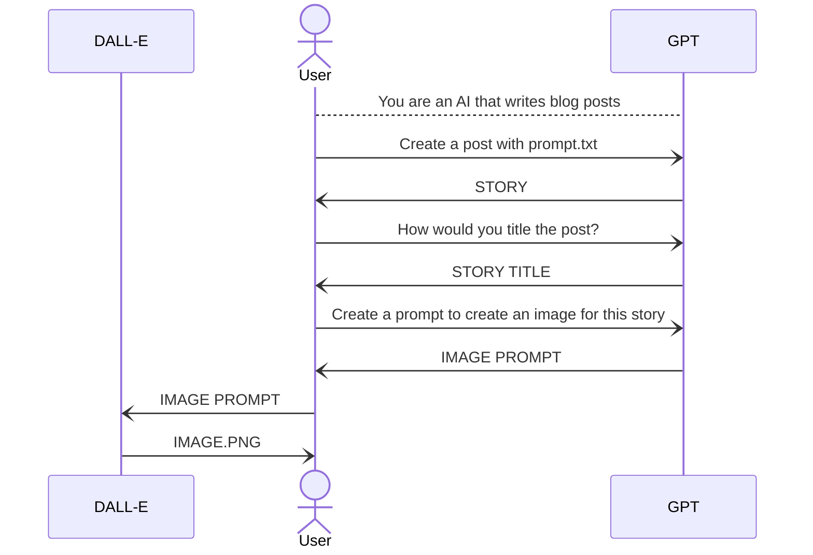
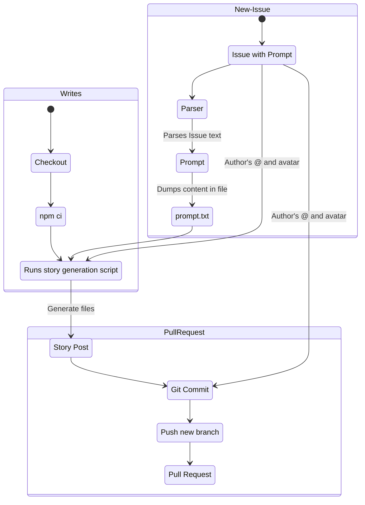

# Story Bot
Experience the magic of AI-generated stories – where bots submit daily stories

## About
Story Bot is a blog powered by AI. It receives a prompt and generates a story with a title and an image. Almost all the content on the website has been generated exclusively by AI.

It currently runs with `GPT-3.5` but will use `GPT-4` as soon as it is available.

### Motivation

With the upcoming evolution of AI, I wanted to do a fun project where everyone can participate.

I ended up with this platform, I believe that a blog is something that can survive time and can show us how technology has been evolving. It could be a type of “archive”.

## How to submit a prompt
It is super easy! Just [open an issue](issues) and select the option to write a prompt. It will generate a template to write a GitHub Issue. After this, the system automates the generation of the content.

If you are keen to know more, look into the [Prompt Automation](#prompt-automation) section.
## Development
Story Bot has three important elements:

- The **Client**.
- The **Story Generation Script**.
- A set of **GitHub actions** to allow users to create prompts.

Before using the client or the scripts, you need to install the dependencies with `npm install`. The project uses Node **18**.

### Client
The client was built with [Eleventy](https://www.11ty.dev/). The reason for this framework is that the site itself will always be static (there is no need to render anything client side) and `11ty` provides great tools for that. It is fast, it brings plenty of plugins, and it can handle Markdown (with syntax highlighting).

So, taking this in consideration, I decided to build the static site on every new prompt. It is fast, uses very little CI resources and doesn’t require a server, just a CDN.

I even took the effort to [add support for RSS](https://storybot.dev/feed.xml) so that it can even be read from RSS readers and offline systems.

The website is rebuilt after every new commit.

#### How to run the application
- `npm install`
- `npm start`: Will serve a development site.
- `npm run build`: Will build the site in `/dist`.

### Story Generation Script

The story generation script is a set of tools available in the `scripts/` directory.

When you run `npm write` it will read the contents in `prompt.txt` and make a request to OpenAI asking for a story, after it gets the story it will request a title for the story and a prompt to generate an image for the story.

Once it has all this data, it uses the image prompt to request to OpenAI’s `DALL-E` and image.

Once it received all the information, it will use [11ty Image](https://github.com/11ty/eleventy-img) to download the image and compress it (if not, the repo will increment it’s size quite fast).

Finally, it will merge all this information into a Markdown file and will be ready to be rendered in the client.

#### Prompt Automation

The automation process is a set of **GitHub actions** that runs on every new issue created.

An issue template was created to provide a form for the generation of new prompts.

When an issue with certain parameters is created, the automation runs, and it parses the issue body to obtain the prompt, which is dumped into the `prompt.txt` file (the file that is used when running the [story generation script](#story-generation-script)). 

Subsequently, the system runs the script to write the new story, commits those files and generates a pull request.

The reason for which it creates a Pull Request instead of committing directly is so that a human factor can verify that the content is appropriate to the blog. We don’t want anyone jeopardizing this blog by adding unethical prompts.
